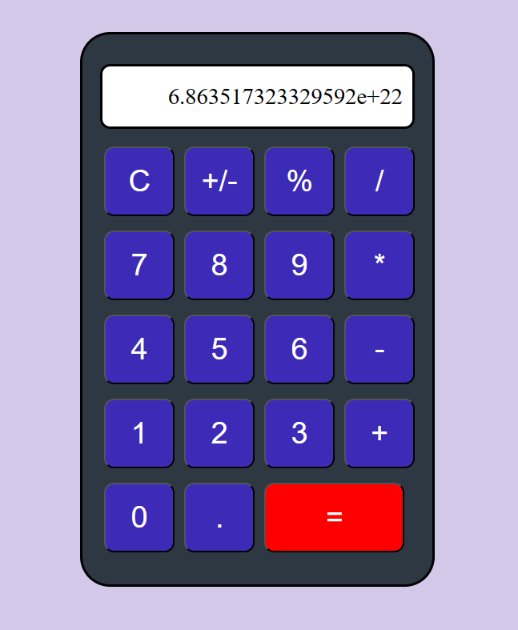

# Калькулятор

The calculator performs the simplest mathematical functions and uses scaling when displaying numbers on the display.
 You can view the project at the following link: [calc](https://calculator-three-pink.vercel.app/).

## Technology Stack
<li>React</li>
<li>UseState</li>
<li>UseEffect</li>

## 🚀 Follow the steps below to work with the application:

Install the package manager

### `npm install`

Start the application

### `npm start`
